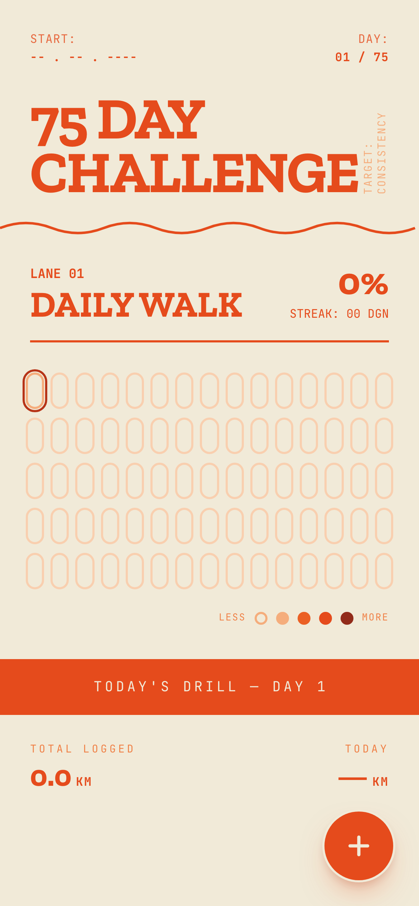
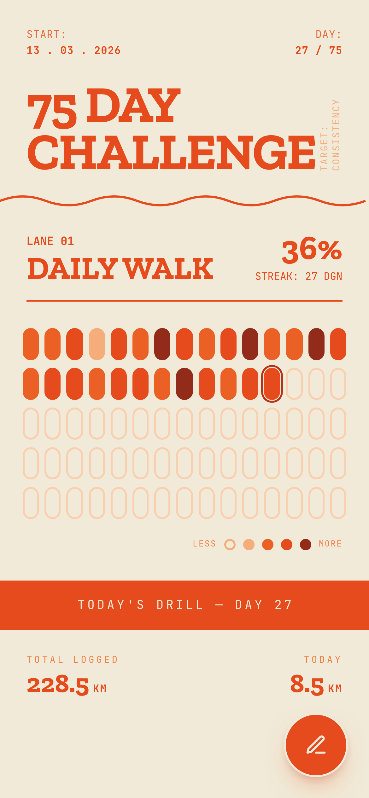
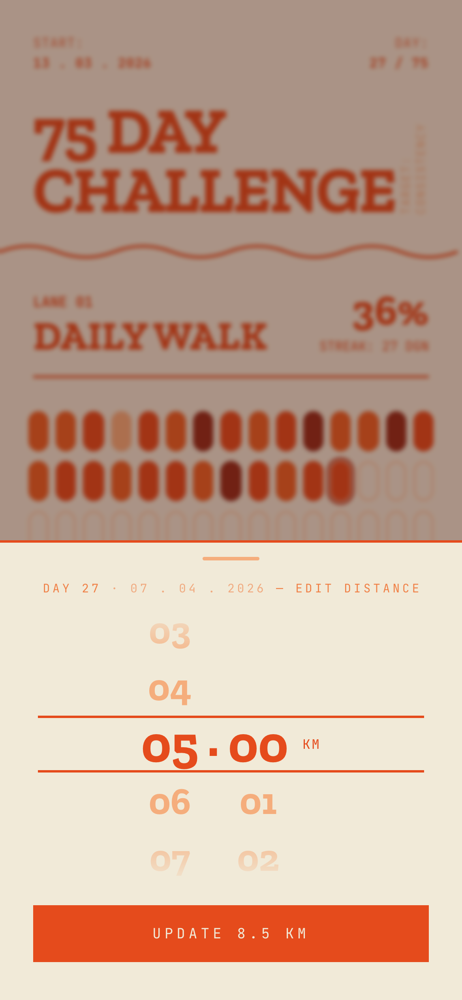

# walkpod

A PWA for a 75-day walking-pad challenge. Spin the roller, log your km. The pill grid heatmaps your daily distances. No GPS, no backend, lives on your phone.

<p align="center">
  
  
  
</p>

## What it does

- 75 capsule pills, one per day, shaded like a GitHub contribution graph. More km that day, darker pill.
- Tap the floating action button to open a bottom sheet with a roller picker. Spin it, hit log.
- Tap any past pill to back-fill or edit that day.
- Day 1 is whenever you log your first walk. Not whenever you opened the app.
- Installable. Works offline. Data lives in your browser's `localStorage`.

## Stack

Vite + React 19 + TypeScript, Tailwind v4, vite-plugin-pwa. That's the whole list.

## Run it

```bash
npm install
npm run dev
```

`npm run build` typechecks and produces a static `dist/` with the service worker baked in.
